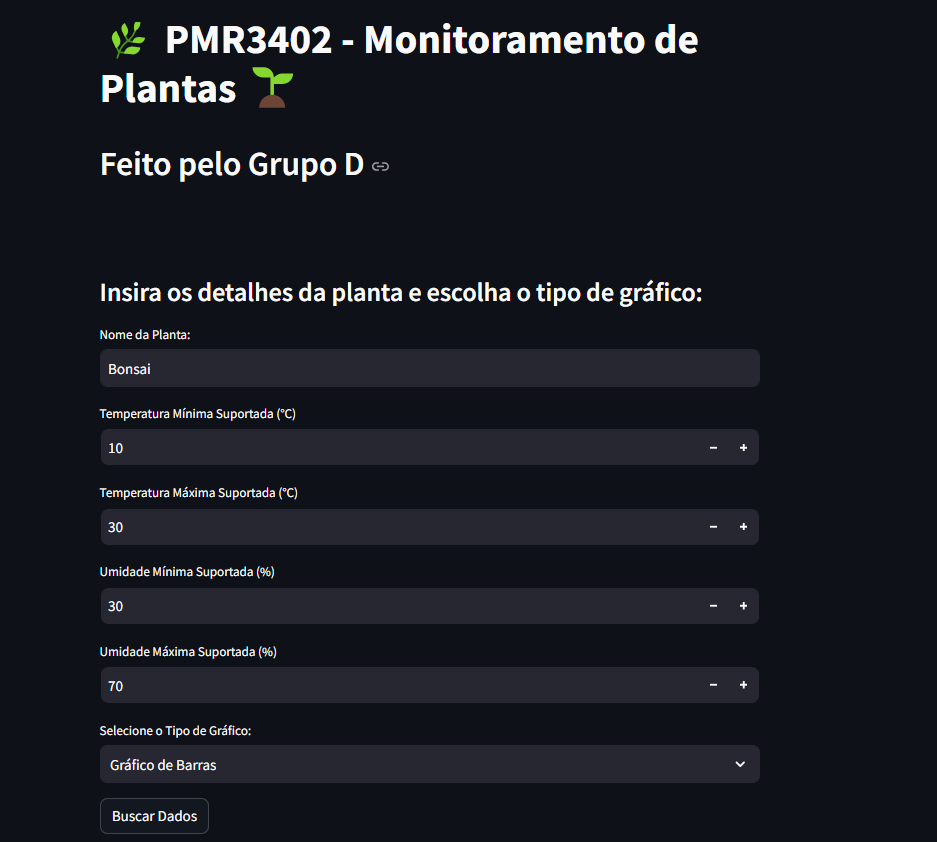
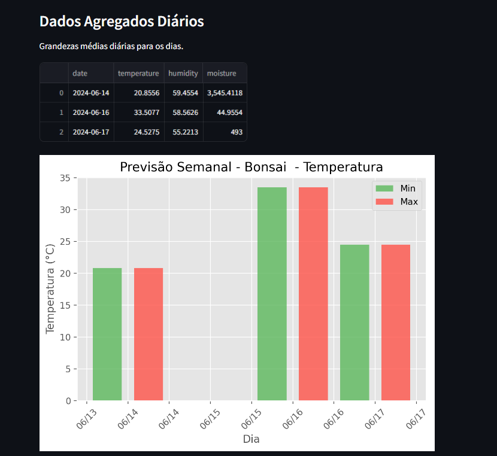

# PMR3402 - Monitoramento de Plantas

Este projeto foi desenvolvido como parte da disciplina PMR3402 - Sistemas Embarcados (2024), para monitoramento da temperatura, umidade do ambiente e umidade do solo de plantas de pequeno porte utilizando o RTOS para valorizar o tempo de resposta dos sensores. A ESP32 conecta-se a uma Rede Wifi com conexão à internet e os dados coletados pelo sensor são enviados a uma database online (Supabase). Para exibir e tratar os dados, o grupo utilizou o Streamlit, um framework em Python que cria uma interface web.

## Montagem do circuito

## Interface Web

## Funcionalidades

- **Inserção de Detalhes da Planta:** O usuário pode inserir o nome da planta, temperatura mínima e máxima suportadas, umidade mínima e máxima suportadas, e escolher entre gráficos de barras ou linhas.
  
- **Busca de Dados:** Ao pressionar o botão "Buscar Dados", a aplicação faz uma consulta ao banco de dados Supabase para obter os dados coletados da planta específica.

- **Filtragem de Dados Errôneos:** Descarta dados de temperatura abaixo de 10°C e umidade abaixo de 30% para evitar leituras incorretas.

- **Visualização de Dados Agregados:** Após a busca, os dados são processados para calcular as grandezas médias diárias de temperatura, umidade e umidade do solo.

- **Gráficos Interativos:** Os dados processados são exibidos em gráficos de barras ou linhas, conforme escolhido pelo usuário. Os gráficos mostram a variação da temperatura e umidade ao longo dos dias.

- **Alertas de Temperatura e Umidade:** A aplicação exibe alertas indicando se os valores coletados estão fora dos limites ideais definidos pelo usuário.

## Tecnologias Utilizadas

- **Streamlit:** Framework de código aberto para criar aplicativos da web de maneira simples e eficiente utilizando Python.

- **Supabase:** Plataforma open-source que fornece bancos de dados PostgreSQL como serviço, com APIs para consultas e manipulação de dados.

- **Matplotlib e Pandas:** Bibliotecas Python amplamente utilizadas para visualização de dados e manipulação de estruturas de dados, respectivamente.

## Pré-Requisitos

- Python 3.6 ou superior
- Bibliotecas necessárias (instaladas via pip):
  - streamlit
  - matplotlib
  - pandas
  - supabase
  - python-dotenv

## Como Executar

1. Clone o repositório para sua máquina local:
   - $ sh
   - $ git clone https://github.com/asforaarthur/pmr3402_projeto_planta.git
   - $ cd monitoramento-plantas
2. Crie e ative um ambiente virtual:
   - $ python -m venv venv
   - $ venv\Scripts\activate
3. Instale as dependências:
   - $ pip install -r requirements.txt
4. Configure as variáveis de ambiente no arquivo .env com as credenciais do Supabase (mais informações ler a documentação):
   - $ SUPABASE_URL = https://seu-supabase-url.supabase.co
   - $ SUPABASE_KEY = sua-chave-supabase
5. Execute a aplicação:
   - $ streamlit run nome_do_arquivo.py

Substitua `nome_do_arquivo.py` pelo nome do seu script principal.

## Autor

- Grupo D

## Licença

© 2024 - Todos os direitos reservados - Grupo D