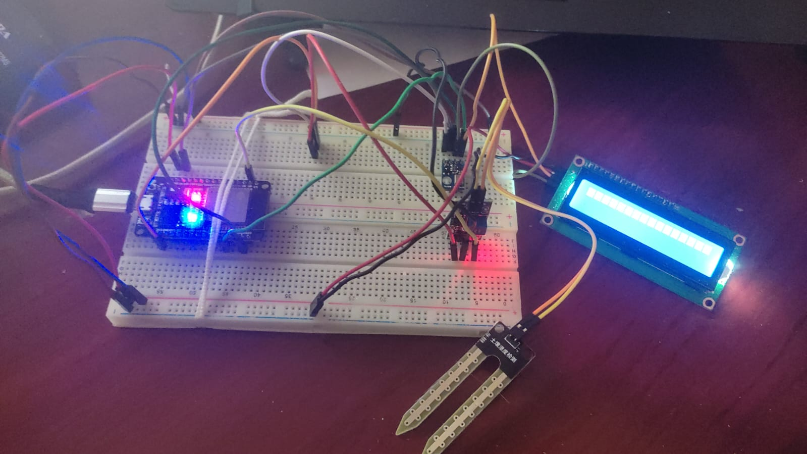

# PMR3402 - GreenHouse Plant Monitoring Project

This project was developed as part of the course **PMR3402 - Embedded Systems (2024)** from the Polytechnic School of the University of São Paulo (POLI-USP), focusing on monitoring temperature, ambient humidity, and soil moisture of small plants. An **RTOS** was used to ensure responsive sensor readings. The **ESP32** connects to a Wi-Fi network with internet access, and the sensor data is sent to an online database (**Supabase**). For data display and processing, the group used **Streamlit**, a Python framework that creates a web interface.

## Circuit Assembly



## Web Interface

  


## Features

- **Plant Details Input:** Users can input the plant name, supported minimum and maximum temperatures, supported humidity range, and select between bar or line charts.
- **Data Retrieval:** When clicking the "Fetch Data" button, the application queries the Supabase database to retrieve data for the specified plant.
- **Error Filtering:** Discards temperature readings below 10°C and humidity below 30% to avoid incorrect data.
- **Aggregated Data Display:** After fetching, the data is processed to calculate daily average temperature, ambient humidity, and soil moisture.
- **Interactive Charts:** Processed data is displayed in bar or line charts, as selected by the user. The charts show temperature and humidity variation over time.
- **Temperature and Humidity Alerts:** The application displays alerts if collected values are outside the user-defined ideal range.

## Technologies Used

- **Streamlit:** Open-source framework for building web apps easily using Python.
- **Supabase:** Open-source platform offering PostgreSQL databases as a service, with APIs for data querying and manipulation.
- **Matplotlib & Pandas:** Widely-used Python libraries for data visualization and data structure handling.

## Prerequisites

- Python 3.6 or higher
- Required libraries (install via pip):
  - streamlit  
  - matplotlib  
  - pandas  
  - supabase  
  - python-dotenv

## How to Run

1. Clone the repository to your local machine:
   ```sh
   git clone https://github.com/asforaarthur/PMR3402_Greenhouse_Project.git
   cd monitoramento-plantas
   ```

2. Create and activate a virtual environment:
   ```sh
   python -m venv venv
   venv\Scripts\activate
   ```

3. Install the dependencies:
   ```sh
   pip install -r requirements.txt
   ```

4. Configure the environment variables in the `.env` file with your Supabase credentials (see documentation for more info):
   ```
   SUPABASE_URL = https://your-supabase-url.supabase.co  
   SUPABASE_KEY = your-supabase-key
   ```

5. Run the application:
   ```sh
   streamlit run your_script_name.py
   ```

   Replace `your_script_name.py` with the name of your main Python script.

## Author

- Group D

## License

© 2024 - All rights reserved - Group D
